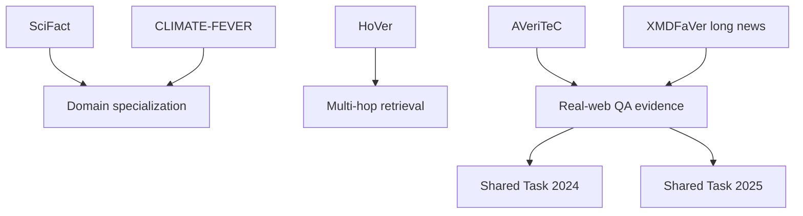

# Literature Survey — HarshaVardhan (Papers 9–15)

**Assignee:** HarshaVardhan  
**Coverage:** Domain-specialized verification (science, climate), multi-hop Wikipedia reasoning, real-web AVeriTeC and its shared tasks, and long-document fact-based news verification  
**Papers folder:** `HarshaVardhan/`  
**Companion full review (all 20 papers):** `../Literature_Review_Factual_NonFactual_Information.md`

---

## 1. Scope and thematic focus

This block moves beyond foundational FEVER/LIAR-style setups into:

1. **Scientific claim verification** (SciFact)
2. **Many-hop Wikipedia verification** (HoVer)
3. **Real-world web evidence with QA justifications** (AVeriTeC)
4. **Climate-domain transfer stress tests** (CLIMATE-FEVER)
5. **Community evaluation of modern RAG/LLM pipelines** (AVeriTeC Shared Tasks 2024 & 2025)
6. **Long news article verification via summarization + fact pools** (Hou et al., 2025)

The unifying theme is **harder evidence conditions**: specialized domains, multi-hop reasoning, open web retrieval, temporal leakage control, and long inputs.

---

## 2. Paper-by-paper survey

### Paper 9 — SciFact (Wadden et al., EMNLP 2020)

**Title.** Fact or Fiction: Verifying Scientific Claims (SciFact)  
**PDF.** `09_SciFact_A_Dataset_for_Scientific_Claim_Verification.pdf`

#### Problem
Retrieve scientific abstracts, decide SUPPORTS / REFUTES / NOINFO for each abstract, and select **rationale sentences**.

#### Dataset
| Item | Value |
|------|-------|
| Claims | **1,409** scientific claims |
| Corpus | **5,183** abstracts (S2ORC / curated journals) |
| Labels | SUPPORTS / REFUTES / NOINFO (+ rationales) |
| Construction | Citances rewritten into atomic claims |

#### Methodology
Abstract retrieval (TF-IDF / neural) → rationale sentence selection → label prediction (**VeriSci** / BERT-to-BERT). Optional FEVER / related pretraining then SciFact fine-tuning.

#### ML models
SciBERT, BioMedRoBERTa, RoBERTa-base/large, Longformer; FEVER-pretrained transfer models.

#### Key findings
RoBERTa-large is strong on label prediction; SciBERT is strong on rationale F1 (~**74**). COVID case study: VeriSci is reasonable on many expert claims, but **retrieval remains a bottleneck**.

#### How it can be used
Biomedical / scientific claim checking, literature triage, rationale evaluation, and science-communication prototypes (including COVID-era claims).

---

### Paper 10 — HoVer (Jiang et al., Findings of EMNLP 2020)

**Title.** HoVer: A Dataset for Many-Hop Fact Extraction and Claim Verification  
**PDF.** `10_HoVer_A_Dataset_for_Many-Hop_Fact_Extraction_and_Verification.pdf`

#### Problem
Many-hop (up to **4** Wikipedia documents) fact extraction and binary claim verification.

#### Dataset
| Item | Value |
|------|-------|
| Size | **26,171** claims |
| Labels | SUPPORTED vs NOT-SUPPORTED (REFUTED + NEI merged) |
| Source | HotpotQA Q–A rewritten into claims; extended to 3/4 hops |
| Mutations | Human + BERT word substitution + negation |

#### Methodology
TF-IDF document retrieval → BERT re-ranking → BERT sentence selection → BERT NLI; oracle gold-evidence ablations.

#### ML models
Bigram TF-IDF; BERT-base for retrieval, selection, and NLI.

#### Key findings
- Full-pipeline HoVer score only **14.9%** on dev vs ~**81%** human  
- Verification with retrieved evidence **73.7%** (oracle evidence **81.2%**; claim-only **63.7%**)  
- Retrieval collapses with hops: TF-IDF finds full evidence in ~**80%** of 2-hop vs ~**15%** of 4-hop cases

#### How it can be used
Stress-test **multi-hop retrieval** for verification; bridge HotpotQA multi-hop QA methods with FEVER-style fact checking.

---

### Paper 11 — AVeriTeC (Schlichtkrull, Guo & Vlachos, NeurIPS 2023)

**Title.** AVeriTeC: A Dataset for Real-world Claim Verification with Evidence from the Web  
**PDF.** `11_AVeriTeC_A_Dataset_for_Real-world_Claim_Verification_with_Evidence_from_the_Web.pdf`

#### Problem
Real-world web claim verification via **question–answer evidence pairs** and textual justifications. Addresses context dependence, evidence sufficiency, and temporal leakage that limit earlier datasets.

#### Dataset
| Item | Value |
|------|-------|
| Size | **4,568** claims from **50** fact-checking organizations |
| Splits | Train 3,068 / Dev 500 / Test 1,000 |
| Labels | Supported; Refuted; Not Enough Evidence; Conflicting Evidence / Cherry-picking |
| Evidence | ~2.6 QA pairs per claim + written justification |
| IAA | κ ≈ 0.619 on verdicts |
| Metadata | speaker, date, location, claim types, fact-checking strategies |

#### Methodology
Five-phase annotation (normalize claim → gather QA evidence → blind verdict/justification). Baseline: generate search questions (BLOOM-7B among strongest tried) → Google Search + BM25 + BERT rerank/answer → BERT stance aggregation → justification generation (BART / BLOOM / Vicuna). Evidence scored with Hungarian METEOR matching; recommended cutoff λ = **0.25**.

#### ML models
BERT-large, BART-large, BLOOM-7B, Vicuna-13B, gpt-3.5-turbo; no-search and gold-evidence oracles.

#### Key findings
Automated Q+A evidence quality ~**0.21**; veracity at λ=0.25 ~**0.15**; gold-evidence veracity ~**0.49**. Large retrieval gap remains—the hard part is finding good evidence, not only classifying once evidence is perfect.

#### How it can be used
Current gold-standard for **real-web, evidence-justified** verification. Train RAG / LLM fact-checkers that must produce questions, answers, and justifications—not only a label. Canonical hub: [fever.ai/dataset/averitec](https://fever.ai/dataset/averitec.html).

---

### Paper 12 — CLIMATE-FEVER (Diggelmann et al., 2020/2021)

**Title.** CLIMATE-FEVER: A Dataset for Verification of Real-World Climate Claims  
**PDF.** `12_CLIMATE-FEVER_A_Dataset_for_Verification_of_Real-World_Climate_Claims.pdf`

#### Problem
Adapt a FEVER-style pipeline to **real climate claims** with Wikipedia evidence; support disputed / conflicting evidence.

#### Dataset
| Item | Value |
|------|-------|
| Claims | **1,535** verifiable climate claims |
| Pair annotations | **7,675** claim–evidence pairs (5 evidence sentences each) |
| Micro labels | SUPPORTS / REFUTES / NOT_ENOUGH_INFO |
| Macro labels | SUPPORTS / REFUTES / DISPUTED / NOT_ENOUGH_INFO |
| Source | Internet climate claims; climate-scientist annotation |

#### Methodology
ALBERT-based Evidence Candidate Retrieval System (trained on FEVER); entailment over claim + top-5 evidence; aggregate micro votes into macro claim labels.

#### ML models
ALBERT (base-v2) ranker; FEVER-trained entailment pipeline.

#### Key findings
Same pipeline ~**77.7%** label accuracy on FEVER dev but only **38.8%** on Climate-FEVER (F1 ~**32.9%**). Real climate discourse and DISPUTED cases are much harder than synthetic FEVER.

#### How it can be used
Domain stress-test for climate misinformation; measure FEVER transfer failure; study disputed-evidence aggregation for science/policy communication tools.

---

### Paper 13 — AVeriTeC Shared Task 2024

**Title.** The Automated Verification of Textual Claims (AVeriTeC) Shared Task  
**PDF.** `13_The_Automated_Verification_of_Textual_Claims_AVeriTeC_Shared_Task.pdf`

#### Problem
Community evaluation of AVeriTeC-style systems on a **new temporally later test set**, using a precomputed **Knowledge Store** (avoid live Google API cost).

#### Dataset / setup
| Item | Value |
|------|-------|
| Train / Dev | AVeriTeC 3,068 / 500 |
| New test | **1,215** claims (up to 2023) |
| Labels | Same 4 AVeriTeC labels |
| Knowledge Store | Precomputed Google docs per claim with temporal cutoffs |
| Metric | AVeriTeC score = veracity accuracy conditional on evidence agreement (Hungarian METEOR cutoff 0.25) |

#### Methodology / models
Participants retrieve or generate QA evidence from the Knowledge Store. Organizer baseline ≈ **0.11** AVeriTeC score. **21+** teams competed; top systems (e.g., TUDA_MAI) reached roughly **0.6+**, driven largely by stronger retrieval/embeddings and LLM pipelines.

#### How it can be used
Reproduce modern retrieval+LLM fact-checking **without** paying for live search; compare against published system papers; use Knowledge Store for fair offline experiments.

---

### Paper 14 — 2nd AVeriTeC Shared Task 2025

**Title.** The 2nd Automated Verification of Textual Claims (AVeriTeC) Shared Task: Open-weights, Reproducible and Efficient Systems  
**PDF.** `14_The_2nd_Automated_Verification_of_Textual_Claims_AVeriTeC_Shared_Task.pdf`

#### Problem
Second shared task with a **2025 test set** (claims from 2024), stricter **open-weight / efficiency** emphasis, and updated evidence-agreement cutoff (λ raised to **0.5**).

#### Dataset / setup
| Item | Value |
|------|-------|
| New test | **1,000** claims (Jan–Dec 2024) |
| Knowledge Store | ~1.02M URLs / ~2.5B tokens |
| Notes | More numerical claims (~39%); greater temporal domain shift |
| Baseline | HerO-inspired Llama-3.1-8B + BM25 + SFR embeddings → AVeriTeC ≈ **0.20** |
| Winner | CTU AIC ≈ **0.33**; several teams faster than baseline |

#### ML models
Open Llama-3.1-class RAG pipelines; BM25 + dense embeddings (e.g., SFR); runtime tracked on fixed VMs; proprietary GPT ablations often reported separately.

#### How it can be used
Latest community reference for **open RAG fact-checking under cost/latency constraints**; evaluate whether smaller open models can approach proprietary GPT pipelines.

---

### Paper 15 — Hou, Ofoghi & Yearwood (Information Sciences, 2025)

**Title.** Misinformation detection with automatic fact-based news verification  
**Local file.** `15_Misinformation_Detection_with_Automatic_Fact-based_News_Verification_SOURCE_LINK.txt`  
**DOI.** https://doi.org/10.1016/j.ins.2025.122868  
**Note.** Full PDF was not downloadable locally (publisher 403); details below are from bibliographic / abstract-level sources.

#### Problem
Explainable, fact-based misinformation detection for **long news articles**, where variable input length and scarce verification supervision are bottlenecks.

#### Approach (XMDFaVer)
1. Summarize long article → short claims  
2. Question generation + answering against a **fact article pool**  
3. Classifier over claim vs retrieved facts → authenticity decision  

Also evaluates with **AVeriTeC** and introduces a **Misbar** long-news resource.

#### ML / methodology framing
Cast long-document detection as IR + claim verification; emphasize explainability via the intermediate QA trail; accuracy reported to improve as more fact articles are available in the pool.

#### How it can be used
Cite as a recent bridge between **summarization**, **AVeriTeC-style QA evidence**, and long-form news authenticity. Obtain Misbar sizes and exact baseline tables from the DOI/publisher PDF for quantitative comparisons.

---

## 3. Comparative synthesis (Papers 9–15)

### 3.1 Dataset / task comparison

| Paper | Scale | Evidence type | Hardness factor |
|-------|------:|---------------|-----------------|
| SciFact | 1.4k claims | Scientific abstracts + rationales | Domain jargon / retrieval |
| HoVer | 26k | Multi-hop Wikipedia | 2–4 hop composition |
| AVeriTeC | 4.6k | Open-web QA + justification | Real claims + temporal web |
| CLIMATE-FEVER | 1.5k | Wikipedia climate evidence | Domain + DISPUTED labels |
| ST 2024 | +1.2k test | Knowledge Store | Temporal shift, no live API |
| ST 2025 | +1k test | Larger Knowledge Store | Open models + efficiency |
| Hou et al. | Misbar + AVeriTeC | Fact-pool QA | Long documents |

### 3.2 Methodology evolution

| Stage | Papers | Dominant stack |
|-------|--------|----------------|
| Domain NLI pipelines | SciFact, Climate-FEVER | SciBERT / ALBERT / RoBERTa + FEVER transfer |
| Multi-hop retrieval | HoVer | TF-IDF + BERT re-rank + BERT NLI |
| Real-web RAG | AVeriTeC, ST24, ST25 | Question gen + search/KS + LLM/BERT verdict |
| Long-doc fact pools | Hou et al. | Summarize → QA against facts → classify |

### 3.3 What this block teaches

1. **Domain transfer from FEVER is fragile** (especially Climate-FEVER).  
2. **Multi-hop retrieval collapses** long before final NLI fails (HoVer).  
3. **AVeriTeC reframes the task** as producing questions, answers, and justifications—not only a label.  
4. Shared tasks show large gains from **retrieval quality + LLMs**, then push toward **open and efficient** systems.  
5. Long news needs an extra **summarization / claim extraction** stage before standard verification.

---

## 4. Recommended reading / project use for HarshaVardhan

**Suggested narrative for a report section:**  
SciFact & Climate-FEVER (domain specialization) → HoVer (multi-hop hardness) → AVeriTeC (real-web QA paradigm) → Shared Tasks 2024/2025 (community SOTA & efficiency) → Hou et al. (long-document extension).

**Possible mini-projects using only these papers:**
- Measure FEVER→Climate-FEVER transfer gap and error types (DISPUTED vs NEI)  
- Ablate hop count on HoVer retrieval EM/F1  
- Implement a minimal AVeriTeC-style QA pipeline on the Knowledge Store from ST2024/ST2025  
- Design a summarize→verify prototype inspired by XMDFaVer on long news

---

## 5. Quick reference table

| # | Paper | Core ML / method | Dataset | Practical use |
|---|-------|------------------|---------|---------------|
| 9 | SciFact | SciBERT / RoBERTa VeriSci | SciFact 1.4k | Scientific claim checking |
| 10 | HoVer | BERT multi-hop retrieval+NLI | HoVer 26k | Multi-hop stress test |
| 11 | AVeriTeC | BERT/BLOOM/Vicuna RAG+QA | AVeriTeC 4.6k | Real-web QA verification |
| 12 | CLIMATE-FEVER | ALBERT FEVER pipeline | 1.5k climate claims | Climate misinformation |
| 13 | AVeriTeC ST 2024 | Retrieval+LLM systems | AVeriTeC + 2024 test | Offline Knowledge Store eval |
| 14 | AVeriTeC ST 2025 | Open Llama-3.1 RAG | AVeriTeC + 2025 test | Efficient open SOTA |
| 15 | Hou et al. 2025 | XMDFaVer summarize+QA | Misbar + AVeriTeC | Long-article detection |

---

## 6. References (Papers 9–15)

9. Wadden et al. (2020). SciFact. https://aclanthology.org/2020.emnlp-main.609/  
10. Jiang et al. (2020). HoVer. https://aclanthology.org/2020.findings-emnlp.309/  
11. Schlichtkrull et al. (2023). AVeriTeC. NeurIPS Datasets & Benchmarks  
12. Diggelmann et al. (2020). CLIMATE-FEVER. https://arxiv.org/abs/2012.00614  
13. Schlichtkrull et al. (2024). AVeriTeC Shared Task. https://aclanthology.org/2024.fever-1.1/  
14. Akhtar et al. (2025). 2nd AVeriTeC Shared Task. https://aclanthology.org/2025.fever-1.15/  
15. Hou, Ofoghi & Yearwood (2025). https://doi.org/10.1016/j.ins.2025.122868  

*Paper PDFs / source links for this survey are in the `HarshaVardhan/` folder.*
