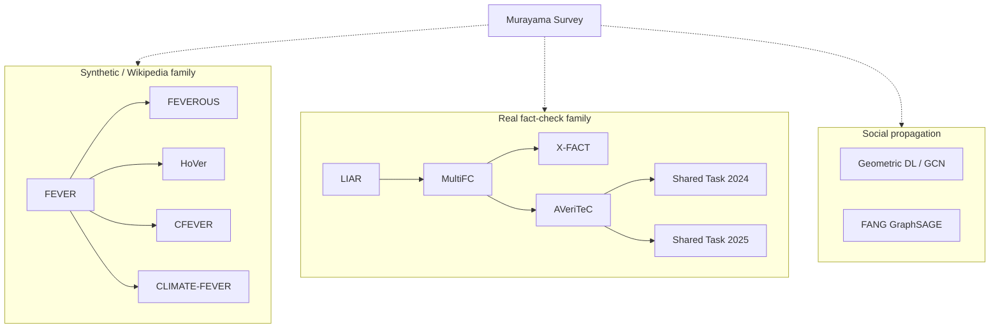

# Literature Review: Factual and Non-Factual Information Detection and Verification

**Scope.** This review synthesizes **20 resources** on factual / non-factual information: dataset papers, model papers, shared tasks, a survey, and community resources listed in `Factual_NonFactual_Research_Papers_Links.docx`. For each entry it covers **task definition**, **datasets**, **methodology**, **ML models**, **key findings**, and **how the work can be used** in research or practice.

**Reading note.** Entries **11** and **18** refer to the same NeurIPS 2023 AVeriTeC paper. Entries **19** and **20** are hubs (Papers With Code; fever.ai), not primary research papers. Entry **15** is open-access by license but the PDF was not locally available at review time; details for that item are therefore more limited.

---

## 1. Introduction and research landscape

Automated systems that decide whether a statement is factual have developed along several overlapping lines:

1. **Claim-only / metadata classification** — predict veracity from the claim text and speaker metadata, without retrieving evidence (e.g., LIAR).
2. **Evidence-based fact verification** — retrieve documents/sentences (often from Wikipedia or the open web) and then perform natural language inference (NLI) style labeling (FEVER and its descendants).
3. **Social-context / propagation modeling** — detect fake news from how content spreads on social networks using graph neural networks (Monti et al.; FANG).
4. **Real-world, multi-domain, multilingual fact checking** — use claims and labels from professional fact-checkers, often with heterogeneous rating scales (MultiFC, X-FACT, AVeriTeC).
5. **Domain-specialized verification** — science (SciFact), climate (CLIMATE-FEVER), Chinese Wikipedia (CFEVER), long news articles (Hou et al.).

A useful organizing distinction is **synthetic Wikipedia claims** (controlled, large, pipeline-friendly) versus **real fact-checked claims** (messy, contextual, temporally grounded, harder for current models).

---

## 2. Foundational datasets and early pipelines

### 2.1 FEVER (Thorne et al., NAACL 2018)

**Problem.** Open-domain claim verification against Wikipedia: retrieve evidence sentences, then label the claim.

| Aspect | Detail |
|--------|--------|
| **Dataset** | FEVER — **185,445** claims derived from Wikipedia introductory sections |
| **Labels** | SUPPORTED, REFUTED, NOT ENOUGH INFO |
| **Evidence** | Sentence-level; ~16.8% need multiple sentences; ~12.2% need multiple pages |
| **IAA** | Fleiss κ = 0.6841 |

**Methodology.** Two-stage annotation: (1) claim generation by mutating Wikipedia sentences (paraphrase, negate, substitute, generalize, specialize); (2) independent claim labeling with evidence selection. System pipeline: **document retrieval → sentence selection → RTE / verdict**.

**ML models.** DrQA-style TF-IDF document retrieval; bigram TF-IDF sentence selection; Decomposable Attention and MLP for RTE.

**Key results.** Best pipeline: **31.87%** accuracy with correct evidence; **50.91%** if evidence correctness is ignored. Sentence selection is the hardest stage.

**How to use it.** Canonical large benchmark for retrieval + verification. Use it to train Wikipedia-centric pipelines, run FEVER-style shared tasks, or as pretraining / transfer source for SciFact, Climate-FEVER, CFEVER, etc. Available via [fever.ai](https://fever.ai).

---

### 2.2 LIAR (Wang, ACL 2017)

**Problem.** Six-way short-statement truthfulness classification from text (and optional metadata), **without** evidence retrieval.

| Aspect | Detail |
|--------|--------|
| **Dataset** | LIAR — **12,836** PolitiFact statements (~2007–2016) |
| **Splits** | Train 10,269 / Val 1,284 / Test 1,283 |
| **Labels** | pants-fire, false, barely-true, half-true, mostly-true, true |
| **Metadata** | speaker, party, job, state, context, subject, credit-history vector |

**Methodology.** Crawl PolitiFact API; map editor labels into six classes; train multi-class classifiers; hybrid CNN fuses text embeddings with metadata.

**ML models.** Majority baseline, SVM, logistic regression, Bi-LSTM, CNN (Kim 2014), **hybrid CNN** (text CNN + metadata → Bi-LSTM → softmax).

**Key results.** Text-only CNN test accuracy **0.270** (majority ~0.208); hybrid text+metadata **0.274**.

**How to use it.** Strong baseline for **claim-only** political veracity. Useful when evidence is unavailable, for few-shot / metadata ablation studies, and as a contrast case against FEVER-style evidence tasks.

---

### 2.3 MultiFC (Augenstein et al., EMNLP 2019)

**Problem.** Multi-domain, evidence-based veracity prediction over **real** fact-check claims with web evidence and rich metadata.

| Aspect | Detail |
|--------|--------|
| **Dataset** | MultiFC — ~**34.9k** claims used experimentally (from 26 English fact-checking sites) |
| **Labels** | Site-specific (heterogeneous; not forced into one scale) |
| **Evidence** | Top Google Search pages per claim |
| **Metadata** | speaker, checker, tags, dates, entities, category, titles |

**Methodology.** Multi-task learning (MTL) across domains with a **Label Embedding Layer**; joint claim–evidence matching and soft evidence ranking; optional metadata CNN.

**ML models.** BiLSTM encoders; MTL / MTL+LEL; claim-only vs evidence-aware variants; metadata CNN.

**Key results.** Best setting (ranked crawled evidence + all metadata): Micro F1 **0.625**, Macro F1 **0.492**. Evidence and metadata both help; MTL+LEL beats single-task learning.

**How to use it.** Testbed for **domain shift**, heterogeneous label spaces, and joint evidence ranking outside Wikipedia. Good bridge between LIAR (real claims, no evidence) and AVeriTeC (structured QA evidence).

---

## 3. Extending FEVER: structure, hops, language, and domain

### 3.1 FEVEROUS (Aly et al., NeurIPS 2021 Datasets & Benchmarks)

**Problem.** Verify claims using **both** Wikipedia prose **and** tables / structured cells.

| Aspect | Detail |
|--------|--------|
| **Dataset** | FEVEROUS — **87,026** claims (Train 71,291 / Dev 7,890 / Test 7,845) |
| **Labels** | Supports, Refutes, Not Enough Info |
| **Evidence** | Sentences + table cells / lists / infoboxes |

**Methodology.** Entity matching + TF-IDF retrieval; table linearization and sequence labeling for cell selection; RoBERTa verdict model pretrained on multiple NLI corpora; bias tracking during annotation.

**ML models.** Sentence-only / table-only / hybrid baselines; claim-only BERT; RoBERTa NLI verdict predictor; RoBERTa cell selector.

**Key results.** Full baseline reaches correct evidence+verdict on only ~**18%** of claims; retrieval fully covers ~**28%**. Hybrid evidence beats sentence-only or table-only.

**How to use it.** Benchmark for **hybrid structured/unstructured** retrieval and verification (financial tables, infoboxes, sports stats). Shared-task material via fever.ai.

---

### 3.2 HoVer (Jiang et al., Findings of EMNLP 2020)

**Problem.** **Many-hop** (up to 4 Wikipedia documents) fact extraction and claim verification.

| Aspect | Detail |
|--------|--------|
| **Dataset** | HoVer — **26,171** claims derived from HotpotQA-style multi-hop reasoning |
| **Labels** | SUPPORTED vs NOT-SUPPORTED (refuted + NEI merged) |
| **Hops** | 2-, 3-, and 4-hop evidence chains |

**Methodology.** TF-IDF document retrieval → BERT re-ranking → BERT sentence selection → BERT NLI; oracle gold-evidence ablations.

**ML models.** Bigram TF-IDF; BERT-base for retrieval, selection, and NLI.

**Key results.** Full-pipeline HoVer score only **14.9%** on dev vs ~**81%** human. With retrieved evidence, verification accuracy **73.7%** (oracle evidence **81.2%**; claim-only **63.7%**). Retrieval collapses as hops increase (~80% full evidence on 2-hop vs ~15% on 4-hop for TF-IDF).

**How to use it.** Stress-test multi-hop retrieval for fact checking; connect HotpotQA multi-hop QA methods to FEVER-style verification.

---

### 3.3 CFEVER (Lin et al., AAAI 2024)

**Problem.** Chinese FEVER-style document/sentence retrieval and 3-way verification over Chinese Wikipedia.

| Aspect | Detail |
|--------|--------|
| **Dataset** | CFEVER — **30,012** claims (~80/10/10 splits) |
| **Labels** | Supports, Refutes, Not Enough Info |
| **IAA** | Fleiss κ = **0.7934** |

**Methodology.** FEVER-like claim generation/labeling; pipeline BM25 or MediaWiki API → BERT sentence retrieval → Chinese BERT-wwm-ext RTE; comparison to strong English FEVER systems ported to Chinese (e.g., BEVERS).

**ML models.** Chinese BERT-wwm-ext; BEVERS with DeBERTa-V2-XL / RoBERTa-large / BERT-base; BigBird sentence retrieval; GPT-3.5 zero/few-shot.

**Key results.** Pipeline FEVER Score: simple baseline **52.47%** vs BEVERS **64.80%** (label accuracy **61.17%** vs **69.73%**). Still substantially harder than English FEVER for the same systems.

**How to use it.** Primary large Chinese Wikipedia verification resource; evaluate cross-lingual transfer from English FEVER models; study multi-page Chinese evidence composition.

---

### 3.4 CLIMATE-FEVER (Diggelmann et al., 2020/2021)

**Problem.** Apply a FEVER-style pipeline to **real** climate claims with Wikipedia evidence; support disputed / conflicting evidence.

| Aspect | Detail |
|--------|--------|
| **Dataset** | CLIMATE-FEVER — **1,535** climate claims; **7,675** claim–evidence annotations (5 sentences each) |
| **Micro labels** | SUPPORTS, REFUTES, NOT_ENOUGH_INFO |
| **Macro labels** | SUPPORTS, REFUTES, DISPUTED, NOT_ENOUGH_INFO |

**Methodology.** ALBERT-based Evidence Candidate Retrieval System (trained on FEVER); entailment over claim + top-5 evidence; aggregate micro votes into macro claim labels.

**ML models.** ALBERT (base-v2) ranker; FEVER-trained entailment pipeline.

**Key results.** Same pipeline ~**77.7%** label accuracy on FEVER dev but only **38.8%** on Climate-FEVER (F1 ~**32.9%**). Real climate discourse and DISPUTED cases are much harder than synthetic FEVER.

**How to use it.** Domain stress-test for climate misinformation; measure FEVER transfer failure; study disputed evidence aggregation for policy/science communication tools.

---

### 3.5 SciFact (Wadden et al., EMNLP 2020)

**Problem.** Scientific claim verification: retrieve abstracts, predict SUPPORTS / REFUTES / NOINFO, and select rationale sentences.

| Aspect | Detail |
|--------|--------|
| **Dataset** | SciFact — **1,409** claims; corpus of **5,183** abstracts |
| **Labels** | SUPPORTS, REFUTES, NOINFO (+ rationale sentences) |
| **Source** | Citances rewritten into atomic claims; S2ORC / curated biomedical literature |

**Methodology.** Abstract retrieval (TF-IDF / neural) → rationale sentence selection → label prediction (**VeriSci** / BERT-to-BERT pipeline); optional FEVER pretraining then SciFact fine-tuning.

**ML models.** SciBERT, BioMedRoBERTa, RoBERTa-base/large, Longformer; FEVER-pretrained transfer models.

**Key results.** RoBERTa-large strong on labels; SciBERT strong on rationale F1 (~**74**). COVID case study: VeriSci reasonable on a majority of expert claims, but retrieval remains a bottleneck.

**How to use it.** Biomedical / scientific claim checking, literature triage, rationale evaluation, and COVID-era science communication prototypes.

---

## 4. Social-context and graph-based fake news detection

### 4.1 Geometric Deep Learning on social media (Monti et al., 2019)

**Problem.** Detect fake vs true news from **propagation structure** on Twitter, not only claim text (language-agnostic signal).

| Aspect | Detail |
|--------|--------|
| **Dataset** | Author Twitter cascade corpus — ~**1,084** labeled claims; ~159k cascades; multi-million-edge graph (2013–2018) |
| **Labels** | true / false (mixed verdicts discarded) |
| **Sources** | Snopes, PolitiFact, BuzzFeed mapped to URLs |

**Methodology.** Build per-URL / cascade graphs (follow + spread); node features from profile, activity, network, content; **graph CNNs** (geometric deep learning); early detection by truncating observation time.

**ML models.** Graph convolutional architectures with feature-group ablations.

**Key results.** URL-wise ROC AUC **92.7% ± 1.8%**; cascade-wise **88.3% ± 2.7%**. With ~2 hours of spread, URL-wise AUC already exceeds **90%**.

**How to use it.** Foundational citation for **propagation-GNN** fake-news detection and early warning systems; contrast with content-only NLP; useful when text is short, multilingual, or adversarially rewritten.

---

### 4.2 FANG (Nguyen et al., CIKM 2020)

**Problem.** Inductive heterogeneous-graph learning for social-context fake news detection, with stance-aware engagements and transfer to source factuality.

| Aspect | Detail |
|--------|--------|
| **Dataset** | FANG social-context corpus — Fake **448** + Real **606** news items; stance subset ~2.5k pairs |
| **Labels** | fake / real (+ stance: Support / Deny / Comment / Report) |
| **Graph** | news, sources, users; friendship, citation, publication, stance edges |

**Methodology.** GraphSAGE-style inductive aggregation; Bi-LSTM + attention over temporal engagements; RoBERTa stance classifier; multi-task losses (news, stance, proximity).

**ML models.** Feature SVM; CSI; transductive GCN; FANG and ablations (no time / no stance).

**Key results.** FANG AUC **0.752** vs GCN **0.706** and CSI **0.691**. Remains relatively strong under limited training data; embeddings transfer to source factuality prediction.

**How to use it.** Inductive GNN baseline for social-context detection; model early engagement attention for explainability; combine with content models in hybrid detectors.

---

## 5. Multilingual and real-web verification

### 5.1 X-FACT (Gupta & Srikumar, 2021)

**Problem.** Multilingual real-world claim veracity with metadata and search snippets; measure in-domain, OOD, and zero-shot language generalization.

| Aspect | Detail |
|--------|--------|
| **Dataset** | X-FACT — **31,189** non-English claims; **25** languages; ~85 fact-checkers |
| **Labels** | Fine-grained truthfulness scale (True → False; paper normalizes heterogeneous ratings) |
| **Splits** | Train/dev + α1 in-domain / α2 OOD / α3 zero-shot language sets |

**Methodology.** Normalize multilingual rating schemes; mBERT claim-only ± metadata; **Attn-EA** attends over mBERT-encoded search snippets.

**ML models.** Majority; claim-only mBERT; claim+meta; Attn-EA; Attn-EA+Meta.

**Key results.** Best Attn-EA+Meta ≈ **41.9** Macro F1 on in-domain α1; OOD/zero-shot much lower (~15–17). Strong claim-only bias; snippets often insufficient vs full pages.

**How to use it.** Main multilingual real-claim benchmark; diagnose cross-lingual overfitting; compare claim-only vs retrieval-augmented multilingual AFC.

---

### 5.2 AVeriTeC dataset (Schlichtkrull, Guo & Vlachos, NeurIPS 2023) — Papers 11 & 18

**Problem.** Real-world web claim verification with **question–answer evidence pairs** and textual justifications, addressing context dependence, evidence sufficiency, and temporal leakage that plague earlier datasets.

| Aspect | Detail |
|--------|--------|
| **Dataset** | AVeriTeC — **4,568** claims from **50** fact-checking organizations |
| **Splits** | Train 3,068 / Dev 500 / Test 1,000 |
| **Labels** | Supported; Refuted; Not Enough Evidence; Conflicting Evidence / Cherry-picking |
| **Evidence** | ~2.6 QA pairs per claim + written justification |
| **IAA** | κ ≈ 0.619 on verdicts |
| **Metadata** | speaker, date, location, claim types, fact-checking strategies |

**Methodology.** Five-phase annotation (normalize claim → gather QA evidence → blind verdict/justification). Baseline system: generate search questions (BLOOM-7B among strongest tried) → Google Search + BM25 + BERT rerank/answer → BERT stance aggregation → justification generation (BART / BLOOM / Vicuna). Evidence scored with Hungarian METEOR matching and cutoff λ (recommended **0.25**).

**ML models.** BERT-large, BART-large, BLOOM-7B, Vicuna-13B, gpt-3.5-turbo; no-search and gold-evidence oracles.

**Key results.** Automated Q+A evidence quality ~**0.21**; veracity at λ=0.25 ~**0.15**; gold-evidence veracity ~**0.49** — large retrieval gap remains.

**How to use it.** Current gold-standard for **real-web, evidence-justified** verification. Train RAG / LLM fact-checkers; require systems to produce questions, answers, and justifications—not only a label. Canonical downloads and schema: [fever.ai/dataset/averitec](https://fever.ai/dataset/averitec.html) (Zenodo DOI 10.5281/zenodo.4911508).

---

### 5.3 AVeriTeC Shared Task 2024 (Paper 13)

**Problem.** Community evaluation of AVeriTeC-style systems on a **new temporally later test set**, using a precomputed **Knowledge Store** (avoid live Google API cost).

| Aspect | Detail |
|--------|--------|
| **Data** | AVeriTeC train/dev + new test (**1,215** claims up to 2023) |
| **Knowledge Store** | Precomputed search documents per claim with temporal cutoffs |
| **Metric** | AVeriTeC score = veracity accuracy conditional on evidence agreement (Hungarian METEOR cutoff 0.25) |

**Methodology / models.** Participants retrieve or generate QA evidence from the Knowledge Store; organizer baseline ~**0.11** AVeriTeC score; **21+** teams competed. Top systems (e.g., TUDA_MAI) reached roughly **0.6+** AVeriTeC score, driven largely by stronger retrieval/embeddings and LLM pipelines.

**How to use it.** Reproduce modern retrieval+LLM fact-checking **without** paying for live search; compare against published system papers; use Knowledge Store for fair offline experiments.

---

### 5.4 2nd AVeriTeC Shared Task 2025 (Paper 14)

**Problem.** Second shared task with a **2025 test set** (claims from 2024), stricter **open-weight / efficiency** emphasis, and updated scoring (evidence cutoff λ raised to **0.5**).

| Aspect | Detail |
|--------|--------|
| **Test set** | **1,000** new claims (Jan–Dec 2024); more numerical claims (~39%) |
| **Knowledge Store** | ~1.02M URLs / ~2.5B tokens |
| **Baseline** | HerO-inspired Llama-3.1-8B + BM25 + SFR embeddings → AVeriTeC ~**0.20** |
| **Winner** | CTU AIC ~**0.33**; several teams faster than baseline |

**How to use it.** Latest community reference for open RAG fact-checking under latency/cost constraints; evaluate whether smaller open models can approach proprietary GPT pipelines.

---

## 6. Applied systems, surveys, and resources

### 6.1 NoFake at CheckThat! 2021 (Kumari) — BERT news classification

**Problem.** CLEF CheckThat! 2021 Task 3: (3A) 4-class news veracity; (3B) topical domain classification.

| Aspect | Detail |
|--------|--------|
| **Labels 3A** | False, Partially False, True, Other |
| **Domains 3B** | Health, Election, Crime, Climate, Economy, Education |
| **Extra data** | ~**206k** crawled fact-checked articles from 90+ sites with label merging |

**Methodology.** Harmonize heterogeneous fact-checker labels; fine-tune **BERT** separately for 3A and 3B with external data.

**Key results.** Macro F1 **83.76%** (3A) and **85.55%** (3B) with additional training data.

**How to use it.** Practical recipe for **label harmonization + BERT multi-class** news classification; domain routing to prioritize human fact-checker effort.

---

### 6.2 Misinformation detection with automatic fact-based news verification (Hou, Ofoghi & Yearwood, *Information Sciences* 2025) — Paper 15

**Problem.** Explainable, fact-based misinformation detection for **long news articles**, where input length and scarce verification supervision are bottlenecks.

| Aspect | Detail |
|--------|--------|
| **Venue** | Information Sciences, Vol. 730, Art. 122868 (DOI [10.1016/j.ins.2025.122868](https://doi.org/10.1016/j.ins.2025.122868)) |
| **Authors** | Ziwei Hou, Bahadorreza Ofoghi, John Yearwood (Deakin) |
| **Pipeline (XMDFaVer)** | Summarize long article → short claims → question generation/answering against a **fact pool** → classifier over claim vs facts |
| **Data** | New **Misbar** long-news resource; also evaluates with **AVeriTeC** |
| **License** | Reported CC BY-NC 4.0 (hybrid OA) |

**Methodology (from available metadata).** Cast long-document detection as IR + claim verification; increase the number of fact articles in the pool to improve authenticity decisions; emphasize explainability via the intermediate QA trail.

**How to use it.** Cite as a recent bridge between **summarization**, **AVeriTeC-style QA evidence**, and long-form news authenticity. Obtain the full PDF / Misbar statistics from the DOI for exact metrics and baselines (local PDF was blocked during collection).

---

### 6.3 Dataset survey (Murayama, 2021) — Paper 17

**Problem.** Survey of **datasets** (not a new detector): catalog resources for fake news detection, fact verification, and related tasks.

| Aspect | Detail |
|--------|--------|
| **Coverage** | **118** datasets (much larger than prior ~27-dataset surveys) |
| **Taxonomy** | misinformation, disinformation, rumor, hoax, satire, hyperpartisan, propaganda, spam, clickbait |
| **Organization** | (1) fake news detection, (2) fact verification, (3) other (analysis, satire, bias) |

**How to use it.** Literature-map backbone: choose datasets by construction method, language, social vs news modality, and whether intention or verifiability is annotated. Pair with method surveys when designing experiments.

---

### 6.4 Papers With Code — Fact Checking task (Paper 19)

**Role.** Community hub historically linking papers ↔ code ↔ datasets ↔ metrics for fact checking (FEVER Score, Acc, F1, etc.).

**How to use it.** Historical index of implementations and reported SOTA numbers. Treat post-2025 status cautiously (service sunset / archival); prefer fever.ai shared-task tables and paper repositories for current numbers.

---

### 6.5 Official AVeriTeC project page (Paper 20)

**Role.** Canonical distribution point for AVeriTeC train/dev, Fever 7/8 Knowledge Stores, blind tests, and evaluation scripts; documents JSON schema (claim, `questions[].answers[]`, label, justification, metadata).

**How to use it.** Primary download/citation hub when building AVeriTeC-compatible systems; authoritative confirmation of size (**~4,568** claims), four labels, and QA evidence format.

---

## 7. Cross-cutting comparison

### 7.1 Datasets at a glance

| Resource | Scale | Evidence type | Labels | Best use |
|----------|------:|---------------|--------|----------|
| FEVER | 185k | Wikipedia sentences | 3-way | Large synthetic pipeline training |
| LIAR | 12.8k | None (metadata) | 6-way | Claim-only political baseline |
| MultiFC | ~35k | Web pages | Multi-domain | Heterogeneous real FC |
| FEVEROUS | 87k | Wiki text + tables | 3-way | Structured+unstructured |
| CFEVER | 30k | Chinese Wikipedia | 3-way | Chinese verification |
| SciFact | 1.4k | Scientific abstracts | 3-way + rationales | Science claims |
| HoVer | 26k | Multi-hop Wikipedia | 2-way | Multi-hop retrieval stress test |
| CLIMATE-FEVER | 1.5k | Wikipedia | 3/4-way incl. DISPUTED | Climate domain |
| X-FACT | 31k | Search snippets | Fine-grained | Multilingual real claims |
| AVeriTeC | 4.6k | Web QA pairs + justification | 4-way | Real-web RAG fact checking |
| Monti Twitter | ~1k claims | Propagation graphs | Binary | Social GNN early detection |
| FANG | ~1k news | Heterogeneous social graph | Binary | Inductive social context |

### 7.2 Model families

| Family | Typical models | Strengths | Weaknesses |
|--------|----------------|-----------|------------|
| Classical ML | SVM, LR | Strong baselines on short text | Limited context |
| Sequence DL | BiLSTM, CNN | Metadata fusion (LIAR) | Weak open-domain retrieval |
| Transformers | BERT, RoBERTa, SciBERT, mBERT, DeBERTa | Strong NLI / classification | Need good evidence |
| Graph NNs | GCN, GraphSAGE + temporal BiLSTM | Early fake detection from spread | Needs social graph access |
| LLM + RAG | BLOOM, Llama-3.1, GPT-3.5, Vicuna | Question generation, justifications | Cost, leakage, evidence faithfulness |

### 7.3 Recurring methodological pattern

Most evidence-based systems converge on a multi-stage pipeline:

1. **Claim understanding / normalization**
2. **Retrieval** (BM25, dense embeddings, search APIs, Knowledge Stores)
3. **Evidence selection / QA construction**
4. **Stance / NLI aggregation → verdict**
5. **Optional justification generation** (especially AVeriTeC)

Failures concentrate in **retrieval and multi-hop composition**, not only in final classifiers—FEVER, HoVer, FEVEROUS, Climate-FEVER, and AVeriTeC all show large oracle–pipeline gaps.

---

## 8. How to use this body of work in a project

**If building a Wikipedia-centric verifier:** start with FEVER → add FEVEROUS for tables → HoVer for multi-hop → CFEVER if you need Chinese.

**If targeting real journalism claims:** LIAR (no evidence) → MultiFC / X-FACT (web evidence, multi-label) → AVeriTeC + 2024/2025 shared-task Knowledge Stores (QA evidence + justifications).

**If detecting viral social misinformation:** Monti geometric DL and FANG for propagation/graph features; combine with content BERT classifiers (NoFake-style) for hybrid systems.

**If specializing by domain:** SciFact (science), CLIMATE-FEVER (climate), CheckThat! / NoFake (news domains), Hou et al. XMDFaVer (long articles + fact pools).

**If surveying or choosing data:** Murayama (118 datasets) + Papers With Code archives + fever.ai downloads.

**Evaluation advice.** Prefer metrics that require **correct evidence**, not label accuracy alone (FEVER Score, FEVEROUS score, HoVer score, AVeriTeC score with METEOR cutoff). Report temporal cutoffs to avoid leakage on real-web tasks.

---

## 9. Open challenges

1. **Retrieval remains the bottleneck** across synthetic and real settings.
2. **Real claims** (climate, politics, multilingual) transfer poorly from FEVER-trained pipelines.
3. **Heterogeneous label schemes** across fact-checkers still require careful harmonization (MultiFC, X-FACT, NoFake).
4. **Explainability and faithfulness** of LLM justifications need stronger checks than surface METEOR overlap.
5. **Efficiency and openness** (AVeriTeC 2025) matter as systems move from research leaderboards to production.
6. **Multimodal and long-document** verification (images, video, full articles) is still thinner than short-claim pipelines—Paper 15 is one step toward long news.

---

## 10. Per-paper quick reference (all 20)

| # | Title (as listed) | Type | Core ML / method | Primary dataset | Practical use |
|---|-------------------|------|------------------|-----------------|---------------|
| 1 | FEVER | Dataset + baseline | TF-IDF + RTE (Decomp. Attn / MLP) | FEVER 185k | Train Wikipedia verifiers |
| 2 | LIAR | Dataset + models | Hybrid CNN + BiLSTM | LIAR 12.8k | Claim-only political baseline |
| 3 | MultiFC | Dataset + MTL | BiLSTM MTL + evidence ranking | MultiFC ~35k | Multi-domain real FC |
| 4 | FEVEROUS | Dataset + baseline | RoBERTa + table cell selection | FEVEROUS 87k | Text+table verification |
| 5 | CFEVER | Dataset + systems | Chinese BERT / DeBERTa / BEVERS | CFEVER 30k | Chinese FEVER-style task |
| 6 | Geometric DL fake news | Model | Graph CNN on cascades | Twitter propagation corpus | Early social detection |
| 7 | FANG | Model | GraphSAGE + BiLSTM + RoBERTa stance | FANG social graph | Inductive social-context GNN |
| 8 | X-FACT | Dataset + models | mBERT + Attn-EA | X-FACT 31k / 25 langs | Multilingual FC benchmark |
| 9 | SciFact | Dataset + VeriSci | SciBERT / RoBERTa pipelines | SciFact 1.4k | Scientific claim checking |
| 10 | HoVer | Dataset + pipeline | BERT multi-hop retrieval+NLI | HoVer 26k | Multi-hop stress test |
| 11 | AVeriTeC (NeurIPS 2023) | Dataset + baseline | BERT/BLOOM/Vicuna RAG+QA | AVeriTeC 4.6k | Real-web QA verification |
| 12 | CLIMATE-FEVER | Dataset + transfer | ALBERT FEVER pipeline | 1.5k climate claims | Climate misinformation |
| 13 | AVeriTeC Shared Task 2024 | Shared task | Retrieval+LLM systems | AVeriTeC + 2024 test | Offline Knowledge Store eval |
| 14 | AVeriTeC Shared Task 2025 | Shared task | Open Llama-3.1 RAG, efficiency | AVeriTeC + 2025 test | Open/efficient SOTA comparison |
| 15 | Hou et al. Info. Sciences 2025 | System | XMDFaVer: summarize+QA+classify | Misbar + AVeriTeC | Long-article fact-based detection |
| 16 | NoFake CheckThat! 2021 | Shared-task system | Fine-tuned BERT | CheckThat! + 206k crawl | 4-class news + domain routing |
| 17 | Murayama survey | Survey | N/A (catalog) | 118 datasets | Dataset selection / taxonomy |
| 18 | AVeriTeC Benchmark (same as #11) | Dataset paper | Same as #11 | Same as #11 | Same as #11 |
| 19 | Papers With Code Fact Checking | Resource | Leaderboard aggregation | Many linked datasets | Find code / historical SOTA |
| 20 | Official AVeriTeC project | Resource | Schema + downloads | AVeriTeC | Canonical data access |

---

## 11. Conclusion

Research on factual vs non-factual information has moved from **small PolitiFact collections** and **synthetic Wikipedia claims** toward **real-web, multilingual, evidence-justified verification**, with parallel progress in **graph-based social detection**. Dataset choice should match the intended setting: FEVER-family resources for controlled retrieval+NLI research; LIAR/MultiFC/X-FACT/AVeriTeC for realistic fact-check claims; Monti/FANG for propagation signals; SciFact/Climate-FEVER for domains; AVeriTeC shared tasks for modern RAG/LLM evaluation under reproducible Knowledge Stores.

The dominant ML stack is now **transformer NLI + dense/sparse retrieval**, increasingly wrapped in **LLM question generation and justification**, while **GNNs** remain important when social context is available. Across nearly every benchmark, **finding the right evidence**—not merely classifying a claim string—remains the central unsolved challenge.

---

## References (linked from the source document)

1. Thorne et al. (2018). FEVER. https://aclanthology.org/N18-1074/  
2. Wang (2017). LIAR. https://aclanthology.org/P17-2067/  
3. Augenstein et al. (2019). MultiFC. https://aclanthology.org/D19-1475/  
4. Aly et al. (2021). FEVEROUS. https://arxiv.org/abs/2106.05707  
5. Lin et al. (2024). CFEVER. https://ojs.aaai.org/index.php/AAAI/article/view/29825 (arXiv:2402.13025)  
6. Monti et al. (2019). Fake News Detection on Social Media using Geometric Deep Learning. https://arxiv.org/abs/1902.06673  
7. Nguyen et al. (2020). FANG. https://arxiv.org/abs/2008.07939  
8. Gupta & Srikumar (2021). X-FACT. https://arxiv.org/abs/2106.09248  
9. Wadden et al. (2020). SciFact. https://aclanthology.org/2020.emnlp-main.609/  
10. Jiang et al. (2020). HoVer. https://aclanthology.org/2020.findings-emnlp.309/  
11/18. Schlichtkrull et al. (2023). AVeriTeC. NeurIPS Datasets & Benchmarks PDF  
12. Diggelmann et al. (2020). CLIMATE-FEVER. https://arxiv.org/abs/2012.00614  
13. Schlichtkrull et al. (2024). AVeriTeC Shared Task. https://aclanthology.org/2024.fever-1.1/  
14. Akhtar et al. (2025). 2nd AVeriTeC Shared Task. https://aclanthology.org/2025.fever-1.15/  
15. Hou, Ofoghi & Yearwood (2025). https://doi.org/10.1016/j.ins.2025.122868  
16. Kumari (2021). NoFake at CheckThat! https://arxiv.org/abs/2108.05419  
17. Murayama (2021). Dataset survey. https://arxiv.org/abs/2111.03299  
19. Papers With Code Fact Checking. https://paperswithcode.com/task/fact-checking  
20. Official AVeriTeC. https://fever.ai/dataset/averitec.html  

*PDFs and related files are stored under `Papers_for_literature_review/`.*
