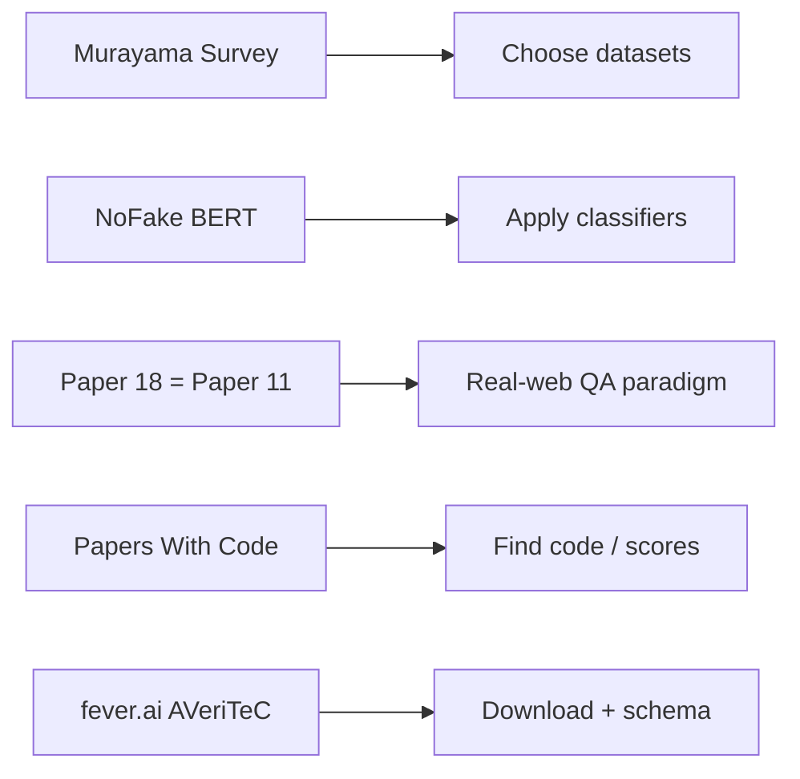

# Literature Survey — Ruthvika (Papers 16–20)

**Assignee:** Ruthvika  
**Coverage:** Applied BERT news classification, comprehensive dataset survey, AVeriTeC benchmark paper (duplicate of Paper 11), and community/data hubs for fact checking  
**Papers folder:** `Ruthvika/`  
**Companion full review (all 20 papers):** `../Literature_Review_Factual_NonFactual_Information.md`

---

## 1. Scope and thematic focus

This final block is more **applied and meta** than the earlier dataset/model papers. It covers:

1. A **shared-task system** that fine-tunes BERT for news veracity and domain routing (NoFake / CheckThat! 2021)
2. A large **dataset survey** that taxonomizes the field (Murayama, 2021)
3. The **AVeriTeC NeurIPS 2023 benchmark paper** again (same work as Paper 11 in HarshaVardhan’s set)
4. **Papers With Code** as a historical SOTA/code hub
5. The **official AVeriTeC project site** as the canonical download and schema reference

Together, these resources answer: *How do practitioners train usable classifiers? How do we choose datasets? Where do we get AVeriTeC data and track related systems?*



---

## 2. Paper-by-paper / resource survey

### Paper 16 — NoFake at CheckThat! 2021 (Kumari)

**Title.** NoFake at CheckThat! 2021: Fake News Detection Using BERT  
**PDF.** `16_NoFake_at_CheckThat_2021_Fake_News_Detection_Using_BERT.pdf`

#### Problem
CLEF CheckThat! 2021 Task 3:
- **3A:** 4-class news veracity classification  
- **3B:** topical domain classification of news articles

#### Dataset / labels
| Item | Value |
|------|-------|
| Task labels (3A) | False, Partially False, True, Other |
| Domains (3B) | Health, Election, Crime, Climate, Economy, Education |
| Extra training data | ~**206,432** crawled fact-checked articles from 90+ sites |
| Challenge | Fact-checkers use **different label schemes** → need merging / harmonization |

#### Methodology
1. Crawl / collect external fact-check corpora  
2. Merge heterogeneous labels into the four CheckThat! classes (drawing on resources such as AMUSED / FakeCovid-style mappings)  
3. Fine-tune **BERT** separately for Task 3A and Task 3B  
4. Compare against settings without external data

#### ML models
Fine-tuned BERT for multi-class classification (vs traditional ML mentioned qualitatively).

#### Key findings
With additional training data:
- Macro F1 **83.76%** on Task 3A  
- Macro F1 **85.55%** on Task 3B  

External merged fact-check data improves generalization across heterogeneous publisher formats.

#### How it can be used
Practical recipe for **label harmonization + BERT multi-class** news classification. Domain prediction (3B) can **route** articles to specialist human fact-checkers (health vs election vs climate), saving manual triage effort.

---

### Paper 17 — Dataset survey (Murayama, 2021)

**Title.** Dataset of Fake News Detection and Fact Verification: A Survey  
**PDF.** `17_Dataset_of_Fake_News_Detection_and_Fact_Verification_A_Survey.pdf`

#### Problem
This is a **survey of datasets**, not a new detection algorithm. Goal: catalog public resources for fake news detection, fact verification, and related tasks, and clarify terminology.

#### Coverage
| Item | Value |
|------|-------|
| Datasets surveyed | **118** (much larger than prior ~27-dataset surveys) |
| Related concepts | misinformation, disinformation, rumor, hoax, satire, hyperpartisan, propaganda, spam, clickbait |
| Organization | (1) fake news detection, (2) fact verification, (3) other (analysis, satire, bias, etc.) |

#### Methodology of the survey
- Collect publicly / easily obtainable web datasets  
- Characterize construction challenges (intention vs verifiability; social media vs news articles; label quality)  
- Summarize fact-checker organizations and dataset-building pitfalls  
- Point to research opportunities rather than crown a single “best” model

#### ML models
N/A (points readers to method surveys elsewhere). Focus is **resource cartography**.

#### Key findings
- Largest-to-date dataset catalog for the area at publication time  
- Terminology is inconsistently used across papers; dataset choice must match the intended construct (e.g., rumor cascades ≠ Wikipedia FEVER claims)  
- Construction pitfalls include crowdsourcing mismatch, English-centric bias, and missing machine-readable evidence

#### How it can be used
**Literature-map backbone** when selecting datasets for a project. Use it before downloading FEVER/LIAR/AVeriTeC/etc., to justify why a given dataset fits the research question. Excellent companion to the Shasank and HarshaVardhan paper sets.

---

### Paper 18 — AVeriTeC Benchmark (NeurIPS 2023)

**Title.** AVeriTeC: A Dataset for Real-world Claim Verification with Evidence from the Web  
**PDF.** `18_AVeriTeC_Benchmark_NeurIPS_2023.pdf`

> **Important:** This is the **same NeurIPS 2023 paper** as Paper 11 in HarshaVardhan’s folder. Paper 18 is the “benchmark / NeurIPS abstract page” listing from the original document list; the downloaded PDF is the full AVeriTeC paper.

#### Problem (recap)
Real-world claim verification with evidence from the open web, annotated as **question–answer pairs** plus textual justifications, with four verdict labels including conflicting/cherry-picked evidence.

#### Dataset (recap)
| Item | Value |
|------|-------|
| Size | **4,568** claims / 50 organizations |
| Splits | Train 3,068 / Dev 500 / Test 1,000 |
| Labels | Supported; Refuted; Not Enough Evidence; Conflicting Evidence / Cherry-picking |
| Evidence | QA pairs (~2.6 / claim) + justification |

#### Methodology / models (recap)
Question generation (e.g., BLOOM-7B) → search + BM25 + BERT answer/rerank → BERT veracity → justification models (BART / BLOOM / Vicuna). Hungarian METEOR evidence scoring with cutoff λ (recommended **0.25**).

#### Key findings (recap)
Large gap between gold-evidence veracity (~**0.49**) and full automated pipeline (~**0.15** at λ=0.25). Retrieval/evidence construction dominates errors.

#### How Ruthvika should use this copy
Treat Paper 18 as the **authoritative problem statement** for AVeriTeC when writing the “benchmark / evaluation” part of the survey. Cross-link to HarshaVardhan’s Papers 13–14 for shared-task evolution, and to Paper 20 for downloads/schema.

---

### Paper 19 — Papers With Code: Fact Checking task

**Title.** Papers With Code — Fact Checking Benchmark / Task page  
**Files.**  
- `19_Papers_With_Code_Fact_Checking_Benchmark.html` (saved page snapshot)  
- `19_Papers_With_Code_Fact_Checking_Benchmark_NOTE.txt`

#### Role
Community hub that historically linked:
- research papers  
- official code repositories  
- datasets  
- metrics / leaderboard scores  

for the **fact-checking** task (examples historically associated with SciFact, AVeriTeC, VitaminC, CFEVER, LIAR variants, etc.).

#### Methodology
Not a research method. Aggregates community-reported **&lt;Task, Dataset, Metric&gt;** tuples and SOTA tables.

#### Caveats
Papers With Code has undergone **service sunset / archival changes** around mid-2025. Treat scores as **historical**, and verify current numbers against:
- fever.ai shared-task tables  
- original papers  
- Hugging Face / GitHub releases  

#### How it can be used
- Find implementation code for FEVER/SciFact/AVeriTeC-style systems  
- Collect historical baseline numbers for a related-work table  
- Discover datasets related to fact checking that are not in the original 20-item list  

---

### Paper 20 — Official AVeriTeC dataset project (fever.ai)

**Title.** Official AVeriTeC Dataset Project  
**Files.**  
- `20_Official_AVeriTeC_Dataset_Project.html`  
- `20_Official_AVeriTeC_Dataset_Project_NOTE.txt`  
**URL.** https://fever.ai/dataset/averitec.html

#### Role
Canonical distribution and documentation hub for AVeriTeC within the broader FEVER ecosystem (FEVER, FEVEROUS, AVeriTeC, AVeriTeC 2.0, workshops/shared tasks).

#### Dataset confirmation from the site
| Item | Value |
|------|-------|
| Claims | **4,568** real-world claims |
| Organizations | **50** fact-checking orgs |
| Labels | Supported; Refuted; Not Enough Evidence; Conflicting Evidence / Cherry-picking |
| Evidence | Question–answer pairs grounded online + textual justifications |
| Metadata | speaker, publisher, claim date, location, claim types, strategies |
| Downloads | Train/Dev; Evidence collections for Fever 7 & 8; blind tests; evaluation scripts |
| Citation / archive | Zenodo DOI https://doi.org/10.5281/zenodo.4911508 |

#### How it can be used
Primary **download/citation hub**. Use it for:
- JSON schema reference (`claim`, `questions[].answers[]`, `label`, `justification`, metadata fields)  
- Getting Knowledge Store / evaluation scripts used in shared tasks  
- Linking workshop history (FEVER → FEVEROUS → AVeriTeC → AVeriTeC 2.0)

---

## 3. Comparative synthesis (Papers 16–20)

### 3.1 What each resource contributes

| # | Resource | Type | Main contribution |
|---|----------|------|-------------------|
| 16 | NoFake | System paper | Practical BERT pipeline + label merging |
| 17 | Murayama survey | Survey | 118-dataset taxonomy / selection guide |
| 18 | AVeriTeC paper | Dataset/benchmark | Real-web QA verification paradigm |
| 19 | Papers With Code | Hub | Code ↔ paper ↔ metric index |
| 20 | fever.ai AVeriTeC | Hub | Official data + schema + eval scripts |

### 3.2 Applied pipeline lesson (from NoFake)

```text
Heterogeneous fact-check sites
        │
        ▼
 Label harmonization (4-way / domains)
        │
        ▼
 Fine-tune BERT (3A veracity / 3B domain)
        │
        ▼
 Deploy for triage + optional human review
```

This is complementary to AVeriTeC’s heavier RAG pipeline: NoFake is closer to **news-article classification**, while AVeriTeC targets **claim verification with evidence**.

### 3.3 Meta-research lesson (from Survey + hubs)

- Always distinguish **fake news detection datasets** vs **fact verification datasets** (Murayama).  
- Prefer evidence-aware metrics (FEVER Score / AVeriTeC score) when the research question is verification, not only classification.  
- Use fever.ai for authoritative AVeriTeC artifacts; use Papers With Code (archives) to find code, then re-check numbers against primary sources.

---

## 4. Recommended reading / project use for Ruthvika

**Suggested narrative for a report section:**  
Murayama survey (map the field) → NoFake (applied BERT classification) → AVeriTeC paper (modern evidence+QA benchmark) → fever.ai (how to obtain data) → Papers With Code (how to find implementations / historical SOTA).

**Possible mini-projects using only these resources:**
- Build a dataset-selection matrix from Murayama categories for a proposed project  
- Reproduce a NoFake-style BERT classifier with harmonized labels  
- Download AVeriTeC via fever.ai and validate JSON schema fields  
- Collect 5 codebases from Papers With Code / GitHub for FEVER or SciFact and compare reported vs reimplemented scores

**Coordination note with teammates:**
- Shasank owns foundational datasets + social GNNs (1–8)  
- HarshaVardhan owns domain/multi-hop/AVeriTeC shared tasks (9–15)  
- Ruthvika owns applied system + survey + hubs (16–20), and the duplicate AVeriTeC paper copy for benchmark writing

---

## 5. Quick reference table

| # | Resource | Core method / role | Data / hub | Practical use |
|---|----------|--------------------|------------|---------------|
| 16 | NoFake CheckThat! 2021 | Fine-tuned BERT | CheckThat! + 206k crawl | 4-class news + domain routing |
| 17 | Murayama survey | Catalog / taxonomy | 118 datasets | Dataset selection guide |
| 18 | AVeriTeC (same as #11) | RAG + QA + justification | AVeriTeC 4.6k | Real-web verification benchmark |
| 19 | Papers With Code | Leaderboard aggregation | Many linked datasets | Find code / historical SOTA |
| 20 | fever.ai AVeriTeC site | Official distribution | AVeriTeC downloads | Schema + data access |

---

## 6. References (Papers 16–20)

16. Kumari (2021). NoFake at CheckThat! https://arxiv.org/abs/2108.05419  
17. Murayama (2021). Dataset survey. https://arxiv.org/abs/2111.03299  
18. Schlichtkrull et al. (2023). AVeriTeC. NeurIPS Datasets & Benchmarks (same as Paper 11)  
19. Papers With Code Fact Checking. https://paperswithcode.com/task/fact-checking  
20. Official AVeriTeC. https://fever.ai/dataset/averitec.html  

*All files for this survey are in the `Ruthvika/` folder.*
