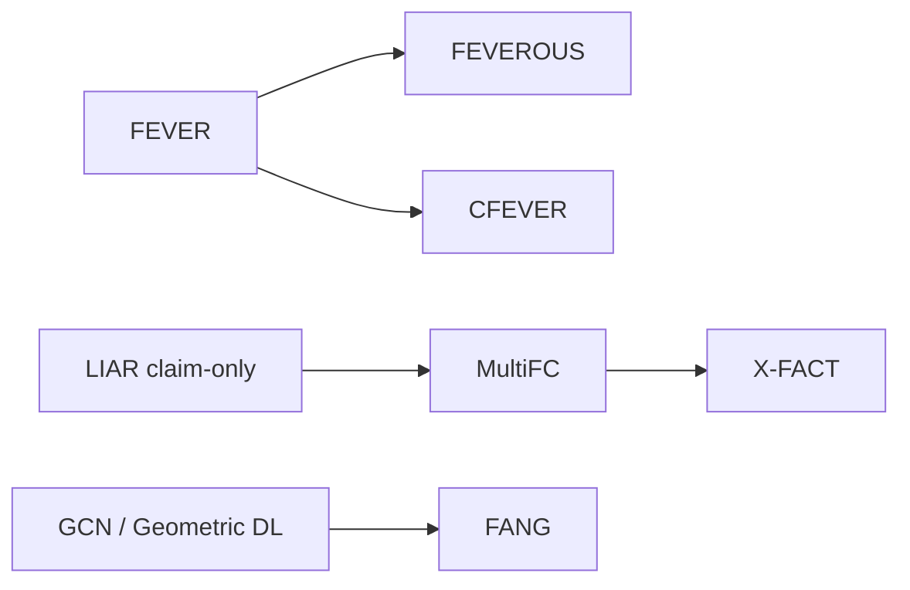

# Literature Survey — Shasank (Papers 1–8)

**Assignee:** Shasank  
**Coverage:** Foundational fact-checking datasets, hybrid Wikipedia verification, Chinese FEVER, social-graph fake news models, and multilingual real-claim benchmarking  
**Papers folder:** `Shasank/`  
**Companion full review (all 20 papers):** `../Literature_Review_Factual_NonFactual_Information.md`

---

## 1. Scope and thematic focus

This survey covers the first eight resources in the factual / non-factual literature set. Together they establish the **core problem formulations** of the field:

1. **Claim-only veracity classification** (LIAR)
2. **Evidence-based verification against Wikipedia** (FEVER → FEVEROUS → CFEVER)
3. **Real multi-domain fact-check claims with web evidence** (MultiFC)
4. **Social propagation / graph neural detection** (Geometric Deep Learning; FANG)
5. **Multilingual real-world fact checking** (X-FACT)

A central tension already appears here: **synthetic Wikipedia claims** are large and pipeline-friendly, while **real fact-checker claims** and **social graphs** better match deployment but are messier for ML.

---

## 2. Paper-by-paper survey

### Paper 1 — FEVER (Thorne et al., NAACL 2018)

**Title.** FEVER: A Large-scale Dataset for Fact Extraction and VERification  
**PDF.** `01_FEVER_A_Large-scale_Dataset_for_Fact_Extraction_and_Verification.pdf`

#### Problem
Open-domain claim verification: given a claim, retrieve evidence from Wikipedia and label it SUPPORTED, REFUTED, or NOT ENOUGH INFO.

#### Dataset
| Item | Value |
|------|-------|
| Size | **185,445** claims |
| Source | Mutated sentences from Wikipedia intros |
| Labels | SUPPORTED / REFUTED / NOT ENOUGH INFO |
| Evidence | Sentence-level; ~16.8% multi-sentence; ~12.2% multi-page |
| IAA | Fleiss κ = 0.6841 |

#### Methodology
- **Claim generation:** extract Wikipedia sentences; mutate via paraphrase, negation, substitution, generalization, specialization  
- **Claim labeling:** separate annotators select evidence and assign labels without seeing the source sentence  
- **System pipeline:** document retrieval → sentence selection → RTE / verdict

#### ML models
- Document retrieval: DrQA-style TF-IDF  
- Sentence selection: unigram/bigram TF-IDF  
- RTE: Decomposable Attention; MLP

#### Key findings
- Best pipeline with **correct evidence**: **31.87%** accuracy  
- Ignoring evidence correctness: **50.91%**  
- Sentence selection is the hardest pipeline stage (oracle ablations)

#### How it can be used
Canonical large benchmark for retrieval + verification. Use for training Wikipedia-centric pipelines, FEVER shared tasks, and transfer/pretraining for later datasets (SciFact, Climate-FEVER, CFEVER). Hub: [fever.ai](https://fever.ai).

---

### Paper 2 — LIAR (Wang, ACL 2017)

**Title.** “Liar, Liar Pants on Fire”: A New Benchmark Dataset for Fake News Detection  
**PDF.** `02_LIAR_A_Benchmark_Dataset_for_Fake_News_Detection.pdf`

#### Problem
Six-way short-statement truthfulness classification from text (+ optional metadata), **without** retrieving evidence.

#### Dataset
| Item | Value |
|------|-------|
| Size | **12,836** PolitiFact statements |
| Splits | Train 10,269 / Val 1,284 / Test 1,283 |
| Labels | pants-fire, false, barely-true, half-true, mostly-true, true |
| Metadata | speaker, party, job, state, context, subject, credit history |

#### Methodology
Crawl PolitiFact API; map editor labels into six classes; train multi-class models; hybrid CNN fuses text with metadata.

#### ML models
Majority, SVM, logistic regression, Bi-LSTM, CNN (Kim 2014), **hybrid CNN** (text CNN + metadata → Bi-LSTM → softmax).

#### Key findings
- Text-only CNN test accuracy **0.270** (majority ≈ 0.208)  
- Hybrid text + metadata: **0.274** — modest but consistent gain

#### How it can be used
Classic **claim-only** political veracity baseline. Useful when evidence is unavailable, for metadata ablations, and as a contrast to FEVER-style evidence tasks.

---

### Paper 3 — MultiFC (Augenstein et al., EMNLP 2019)

**Title.** MultiFC: A Real-World Multi-Domain Dataset for Evidence-Based Fact Checking of Claims  
**PDF.** `03_MultiFC_A_Real-World_Multi-Domain_Dataset_for_Evidence-Based_Fact_Checking.pdf`

#### Problem
Multi-domain veracity prediction over **real** fact-check claims with retrieved web pages and rich metadata; joint evidence ranking + label prediction.

#### Dataset
| Item | Value |
|------|-------|
| Size | ~**34,918** claims used experimentally (26 English FC sites) |
| Labels | Site-specific / heterogeneous scales |
| Evidence | Google Search top pages |
| Metadata | speaker, checker, tags, dates, entities, category, titles |

#### Methodology
Multi-task learning (MTL) across domains with a **Label Embedding Layer (LEL)**; claim–evidence matching; soft evidence ranking; optional metadata CNN.

#### ML models
BiLSTM sentence encoders; MTL / MTL+LEL; claim-only vs evidence-aware models; metadata CNN.

#### Key findings
Best setting (ranked crawled evidence + all metadata): Micro F1 **0.625**, Macro F1 **0.492**. Evidence encoding and metadata both help; MTL+LEL ≫ single-task learning.

#### How it can be used
Testbed for **domain shift**, heterogeneous label spaces, and joint evidence ranking outside Wikipedia. Bridge between LIAR (real claims, no evidence) and later AVeriTeC-style web verification.

---

### Paper 4 — FEVEROUS (Aly et al., NeurIPS 2021 D&B)

**Title.** FEVEROUS: Fact Extraction and VERification Over Unstructured and Structured information  
**PDF.** `04_FEVEROUS_Fact_Extraction_and_Verification_over_Structured_and_Unstructured_Information.pdf`

#### Problem
Verify claims using Wikipedia **sentences and tables** (hybrid structured + unstructured evidence).

#### Dataset
| Item | Value |
|------|-------|
| Size | **87,026** claims (Train 71,291 / Dev 7,890 / Test 7,845) |
| Labels | Supports / Refutes / Not Enough Info |
| Evidence | Sentences + table cells / lists / infoboxes |

#### Methodology
Entity matching + TF-IDF retrieval; table linearization + sequence labeling for cell selection; RoBERTa verdict model pretrained on multiple NLI datasets; annotation bias tracking (nPMI).

#### ML models
Sentence-only / table-only / hybrid baselines; claim-only BERT; RoBERTa (NLI-pretrained) verdict predictor; RoBERTa table cell selector.

#### Key findings
Full baseline: correct evidence+verdict on ~**18%** of claims; retrieval fully covers ~**28%**. Hybrid evidence beats sentence-only or table-only.

#### How it can be used
Benchmark for **table+text** retrieval and hybrid verification (stats, infoboxes, sports/finance tables). Extends FEVER beyond prose-only evidence.

---

### Paper 5 — CFEVER (Lin et al., AAAI 2024)

**Title.** CFEVER: A Chinese Fact Extraction and VERification Dataset  
**PDF.** `05_CFEVER_Chinese_Fact_Extraction_and_Verification_Dataset.pdf`

#### Problem
Chinese FEVER-style document + sentence retrieval and 3-way verification over Chinese Wikipedia.

#### Dataset
| Item | Value |
|------|-------|
| Size | **30,012** claims (~80/10/10) |
| Labels | Supports / Refutes / Not Enough Info |
| IAA | Fleiss κ = **0.7934** |
| Source | Mutated Chinese Wikipedia sentences |

#### Methodology
FEVER-like claim generation/labeling; pipeline BM25 or MediaWiki API → BERT sentence retrieval → Chinese BERT-wwm-ext RTE; compare against strong English FEVER systems ported to Chinese (e.g., BEVERS).

#### ML models
Chinese BERT-wwm-ext; BEVERS with DeBERTa-V2-XL / RoBERTa-large / BERT-base; BigBird sentence retrieval; GPT-3.5 zero/few-shot.

#### Key findings
Pipeline FEVER Score: baseline **52.47%** vs BEVERS **64.80%** (label accuracy **61.17%** vs **69.73%**). Still substantially harder than English FEVER for comparable systems.

#### How it can be used
Primary large **Chinese** Wikipedia verification resource; evaluate cross-lingual transfer from English FEVER; study multi-page Chinese evidence composition.

---

### Paper 6 — Geometric Deep Learning for fake news (Monti et al., 2019)

**Title.** Fake News Detection on Social Media using Geometric Deep Learning  
**PDF.** `06_Fake_News_Detection_on_Social_Media_using_Geometric_Deep_Learning.pdf`

#### Problem
Detect fake vs true news from **Twitter propagation structure**, not only claim text (more language-agnostic).

#### Dataset
| Item | Value |
|------|-------|
| Scale | ~**1,084** labeled claims; ~159k cascades; multi-million-edge social graph |
| Labels | true / false |
| Sources | Snopes, PolitiFact, BuzzFeed mapped to URLs |

#### Methodology
Build per-URL / cascade graphs (follow + spread); node features from profile, activity, network, content; train **graph CNNs**; early detection by truncating observation windows.

#### ML models
Geometric deep learning / GCN-style graph convolutions; feature-group ablations (profile, activity, network, content).

#### Key findings
URL-wise ROC AUC **92.7% ± 1.8%**; cascade-wise **88.3% ± 2.7%**. With ~2 hours of spread, URL-wise AUC already exceeds **90%**.

#### How it can be used
Foundational **propagation-GNN** approach for early social misinformation warning; contrast with content-only NLP; useful when text is short, multilingual, or rewritten.

---

### Paper 7 — FANG (Nguyen et al., CIKM 2020)

**Title.** FANG: Leveraging Social Context for Fake News Detection Using Graph Representation  
**PDF.** `07_FANG_Leveraging_Social_Context_for_Fake_News_Detection.pdf`

#### Problem
Inductive heterogeneous-graph representation learning for social-context fake news detection, with stance-aware engagements and transfer to source factuality.

#### Dataset
| Item | Value |
|------|-------|
| News | Fake **448** + Real **606** |
| Stance subset | ~2,527 labeled source–target pairs |
| Graph nodes | news articles, sources, users |
| Edges | friendship, citation, publication, stance |

#### Methodology
GraphSAGE-style inductive aggregation; Bi-LSTM + attention over temporal engagements; RoBERTa stance classifier; multi-loss training (news, stance, proximity).

#### ML models
Feature SVM; CSI; transductive GCN; FANG and ablations (no time / no stance).

#### Key findings
FANG AUC **0.752** vs GCN **0.706** and CSI **0.691**. Relatively robust under limited training data; representations transfer to source factuality prediction.

#### How it can be used
Inductive GNN baseline for social-context detection; model early engagement attention for explainability; combine with content models in hybrid detectors.

---

### Paper 8 — X-FACT (Gupta & Srikumar, 2021)

**Title.** X-FACT: A New Benchmark Dataset for Multilingual Fact Checking  
**PDF.** `08_X-FACT_A_Multilingual_Dataset_for_Explainable_Fact_Checking.pdf`

#### Problem
Multilingual real-world claim veracity with metadata and search snippets; evaluate in-domain, OOD, and zero-shot language generalization.

#### Dataset
| Item | Value |
|------|-------|
| Size | **31,189** non-English claims |
| Languages | **25** languages / ~85 fact-checkers |
| Labels | Fine-grained truthfulness (True → False; normalized from heterogeneous FC scales) |
| Splits | Train/dev + α1 in-domain / α2 OOD / α3 zero-shot |

#### Methodology
Normalize multilingual rating schemes; mBERT claim-only ± metadata; **Attn-EA** attends over mBERT-encoded search snippets as evidence.

#### ML models
Majority; claim-only mBERT; claim+meta; Attn-EA; Attn-EA+Meta.

#### Key findings
Best Attn-EA+Meta ≈ **41.9** Macro F1 on in-domain α1; OOD/zero-shot much harder (~15–17). Strong claim-only bias; snippets often insufficient compared with full pages.

#### How it can be used
Main **multilingual** real-claim benchmark; diagnose cross-lingual overfitting; compare claim-only vs retrieval-augmented multilingual automatic fact checking (AFC).

---

## 3. Comparative synthesis (Papers 1–8)

### 3.1 Dataset comparison

| Paper | Scale | Evidence? | Setting | Label scheme |
|-------|------:|-----------|----------|--------------|
| FEVER | 185k | Wikipedia sentences | Synthetic EN | 3-way |
| LIAR | 12.8k | No (metadata) | Real politics EN | 6-way |
| MultiFC | ~35k | Web pages | Real multi-domain EN | Heterogeneous |
| FEVEROUS | 87k | Wiki text + tables | Synthetic EN | 3-way |
| CFEVER | 30k | Chinese Wikipedia | Synthetic ZH | 3-way |
| Monti | ~1k claims | Propagation graphs | Twitter | Binary |
| FANG | ~1k news | Heterogeneous social graph | Social + news | Binary |
| X-FACT | 31k | Search snippets | Real multilingual | Fine-grained |

### 3.2 Methodology / ML families

| Family | Papers | Typical models |
|--------|--------|----------------|
| Classical + early DL | LIAR | SVM, LR, CNN, BiLSTM |
| Retrieval + RTE pipeline | FEVER, FEVEROUS, CFEVER | TF-IDF/BM25 + BERT/RoBERTa/DeBERTa |
| Multi-task / metadata | MultiFC, LIAR, X-FACT | MTL+LEL, hybrid CNN, mBERT+meta |
| Graph neural networks | Monti, FANG | GCN, GraphSAGE + temporal BiLSTM |
| Multilingual transformers | X-FACT, CFEVER | mBERT, Chinese BERT-wwm-ext |

### 3.3 What this block teaches

1. **Evidence retrieval is the bottleneck** even on FEVER/FEVEROUS/CFEVER.  
2. **Real claims** (MultiFC, X-FACT) need heterogeneous label handling and web evidence.  
3. **Social context** (Monti, FANG) enables strong early detection when graphs are available.  
4. **Language transfer** is non-trivial: CFEVER and X-FACT both show English-centric systems degrade outside English Wikipedia / English FC sites.

---

## 4. Recommended reading / project use for Shasank

**Suggested narrative for a report section:**  
Start with LIAR (claim-only) → FEVER (evidence pipeline) → FEVEROUS (tables) & CFEVER (Chinese) → MultiFC & X-FACT (real / multilingual) → Monti & FANG (social graphs).

**Possible mini-projects using only these papers:**
- Reproduce FEVER pipeline stages and measure where accuracy drops  
- Compare claim-only LIAR CNN vs MultiFC evidence-aware MTL  
- Contrast Monti GCN vs FANG GraphSAGE on social-context AUC and inductive setting  
- Evaluate multilingual mBERT claim-only bias on X-FACT α1/α2/α3

---

## 5. Quick reference table

| # | Paper | Core ML | Dataset | Practical use |
|---|-------|---------|---------|---------------|
| 1 | FEVER | TF-IDF + RTE | FEVER 185k | Train Wikipedia verifiers |
| 2 | LIAR | Hybrid CNN + BiLSTM | LIAR 12.8k | Claim-only baseline |
| 3 | MultiFC | BiLSTM MTL + evidence ranking | MultiFC ~35k | Multi-domain real FC |
| 4 | FEVEROUS | RoBERTa + table cells | FEVEROUS 87k | Text+table verification |
| 5 | CFEVER | Chinese BERT / DeBERTa | CFEVER 30k | Chinese FEVER-style task |
| 6 | Geometric DL | Graph CNN | Twitter cascades | Early social detection |
| 7 | FANG | GraphSAGE + BiLSTM | FANG social graph | Inductive social GNN |
| 8 | X-FACT | mBERT + Attn-EA | X-FACT 31k / 25 langs | Multilingual FC benchmark |

---

## 6. References (Papers 1–8)

1. Thorne et al. (2018). FEVER. https://aclanthology.org/N18-1074/  
2. Wang (2017). LIAR. https://aclanthology.org/P17-2067/  
3. Augenstein et al. (2019). MultiFC. https://aclanthology.org/D19-1475/  
4. Aly et al. (2021). FEVEROUS. https://arxiv.org/abs/2106.05707  
5. Lin et al. (2024). CFEVER. https://arxiv.org/abs/2402.13025  
6. Monti et al. (2019). Geometric Deep Learning fake news. https://arxiv.org/abs/1902.06673  
7. Nguyen et al. (2020). FANG. https://arxiv.org/abs/2008.07939  
8. Gupta & Srikumar (2021). X-FACT. https://arxiv.org/abs/2106.09248  

*All PDFs for this survey are in the `Shasank/` folder.*
